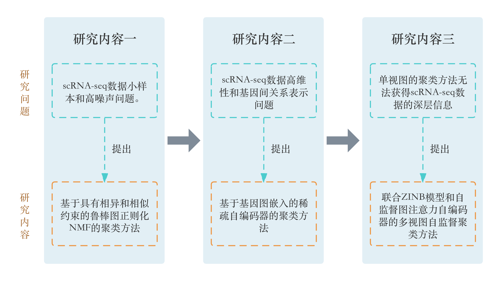

# 龙清涵大论文

面向单细胞RNA-seq数据的聚类方法研究

> **作者：** 龙清涵

## 摘要

近年来，单细胞RNA测序技术的快速发展使研究人员能够在单细胞水平上进行大规模的转录组分析。单细胞聚类在此类数据处理中起到了关键作用，它可以帮助研究人员揭示新的细胞亚群。目前有许多针对scRNA-seq数据的聚类算法，但普遍面临着维度灾难、数据缺失、数据稀疏性和小样本等问题的挑战。因此，本文基于传统和深度学习方法提出了一些相关算法来解决单细胞聚类在实际应用中存在的这些问题。本文主要的研究内容如下：

（1）提出一种基于非负矩阵分解的单细胞聚类分析方法。针对scRNA-seq数据小样本、高维性和高噪声问题。该方法巧妙地融入了先验知识，并采用相异性和相似性的约束条件来指导模型的训练过程，有效地解决了在样本量较小、标签难以确认的情况下机器学习训练的难题。此外，该方法还采用了图正则化技术来保持高维数据中的流形结构，确保在降维过程中保留更多的有用信息，并通过采用$l_{2,1}$范数来计算重构损失提高了模型的稳健性。在多个公共数据集上的大量实验证明了该方法在单细胞聚类任务中的有效性。

（2）提出一种结合图卷积神经网络和自编码器的单细胞聚类新方法。针对scRNA-seq数据高维性和经典深度学习方法未考虑基因和基因之间关系的问题。该方法采用两个自编码器分别对细胞和基因进行低维表示的学习，并通过矩阵乘法来重建细胞的基因表达矩阵。由于保持细胞数据的流形结构对于提高后续分析的准确性至关重要。因此，在细胞的自编码器中实施了图正则化，以保持这种流形结构。同时，为了适应基因表达矩阵的稀疏特性，对细胞的自编码器施加了稀疏约束。另一方面，基因的自编码器利用图卷积捕捉基因间关系，增强差异表达基因信号，可以更精确地描述细胞的异质性。大量实验实验表明，该方法通过图卷积构建的基因自编码器能够提升单细胞聚类的精度。

（3）提出一种联合零膨胀负二项分布模型和图注意力自编码器的多视图自监督聚类方法。针对单视图的聚类方法无法获得更深层次的数据信息，和dropout事件导致的数据高噪声问题。该方法创新性地将多视图分析技术应用于单细胞聚类，从而能够从多个角度深入挖掘基因表达数据中的信息。该方法通过筛选高可变基因和使用主成分分析构建数据视图，既利用高可变基因提升了聚类的准确性，也保留了非高可变基因的深层信息。在单个视图的分析中，研究采用了图卷积网络和自编码器的结构，并使用零膨胀负二项分布模型来重构数据特征，零膨胀负二项分布模型的特点可以减少基因测序技术带来的数据丢失事件对数据的负面影响。为了进一步提高子空间聚类的精确度，该方法通过施加稀疏约束来减轻scRNA-seq数据稀疏性带来的影响，并采用自监督学习策略来优化模型性能。通过大量实验可知，该方法与单视图聚类方法和非零膨胀负二项分布方法相比能够获得更好的聚类效果。

> **关键词：**单细胞聚类；非负矩阵分解；图自编码器；零膨胀负二项分布；多视图；自监督

## 小论文

1. Shu Z, Long Q, Zhang L, et al. Robust Graph Regularized NMF with Dissimilarity and Similarity Constraints for ScRNA-seq Data Clustering[J]. Journal of Chemical Information and Modeling, 2022, 62(23): 6271-6286.

> 引用：
>
> @article{shu2022robust,
>   title={Robust graph regularized NMF with dissimilarity and similarity constraints for ScRNA-seq data clustering},
>   author={Shu, Zhenqiu and Long, Qinghan and Zhang, Luping and Yu, Zhengtao and Wu, Xiao-Jun},
>   journal={Journal of Chemical Information and Modeling},
>   volume={62},
>   number={23},
>   pages={6271--6286},
>   year={2022},
>   publisher={ACS Publications}
> }

If you have any problems, contact me via longqinghan@126.com.
